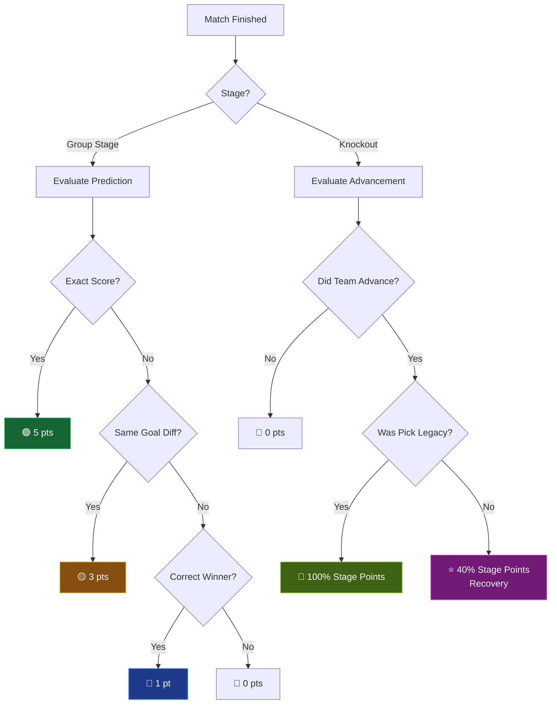
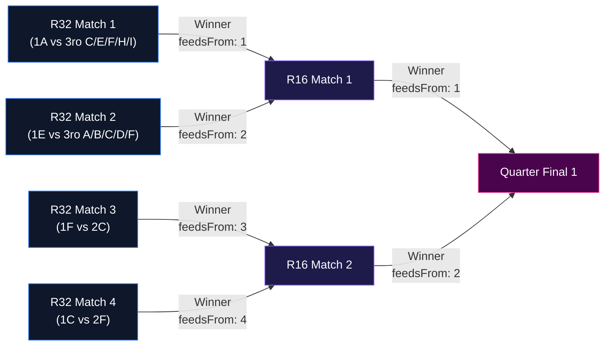

# 🏆 WC26 Prediction Pool


<p align="center">
  
  
  
  
  
</p>

## 📖 What is this?
**WC26 Prediction Pool** is a modern, high-performance web application designed for predicting the upcoming 2026 FIFA World Cup matches. Built with the powerful Next.js App Router and Supabase, it allows users to join groups, make group-stage and knockout-stage predictions, and compete on a global or private leaderboard based on a sophisticated and highly dynamic scoring algorithm.

Designed explicitly for the new **48-team format**, this app includes complex bracket resolutions mapping out the top 2 teams of each group plus the intricate math of advancing the 8 best 3rd-place teams!

---

## 📸 Features

<p align="center">
  
</p>

---

## 🛠 Setup Instructions

### 1. Prerequisites
- [Node.js](https://nodejs.org/) (v18+)
- [Docker](https://www.docker.com/) (optional, for local DB/hosting)
- A [Supabase](https://supabase.com/) project

### 2. Environment Variables
Clone the example environment file to create your own:
```bash
cp .env.local.example .env.local
```
Fill in your Supabase details (`NEXT_PUBLIC_SUPABASE_URL` and `NEXT_PUBLIC_SUPABASE_ANON_KEY`) in the `.env.local` file.

### 3. Run Locally

**Using Node:**
```bash
npm install
npm run dev
```

**Using Docker:**
```bash
make build
make up
```
The app will be available at `http://localhost:3000`.

---

## 🧠 For the Devs: Under the Hood

### The Scoring Algorithm 📊
The platform uses a two-tier scoring system designed to reward precision while keeping the competition balanced. 




**Group Stage (Match-by-Match):**
- **Exact Score (`exact_score`):** 5 points.
- **Goal Difference (`goal_diff`):** 3 points (covers correct draw predictions or exact winning margins).
- **Correct Winner (`correct_winner`):** 1 point.

**Knockout Stage (Legacy vs. Recovery System):**
Predicting an entire 32-team knockout bracket from the start is chaotic. To keep users engaged, the engine introduces **Legacy** and **Recovery** points.
- **Legacy Points (100% value):** Awarded if the user predicted the advancing team *before* the tournament or stage started.
- **Recovery Points (40% value):** If a user's initial bracket gets busted, they can make "recovery" picks as the tournament progresses. These are worth only 40% (floored) of the original value to maintain the advantage of early correct predictions.

| Stage | Legacy Points | Recovery Points |
| :--- | :---: | :---: |
| **Round of 32** | 10 | 4 |
| **Round of 16** | 20 | 8 |
| **Quarter-finals**| 40 | 16 |
| **Semi-finals** | 80 | 32 |
| **Final** | 150 | 60 |

### Handling Knockout Branches (The 48-Team Format) 🏆
Handling the massive 48-team World Cup bracket is significantly more complicated than a standard 32-team tree because the **Round of 32** dynamically pulls from 12 groups (A-L), plus the complex combination of the 8 best 3rd-place teams.

Instead of hardcoding messy nested arrays, the bracket is defined functionally in `src/lib/bracket-structure.ts` using a **Graph/Feeder Model**:

1. **Dynamic Slots:** `R32` matches are defined by explicit slot types (e.g., `1E` vs `3ro A/B/C/D/F`). The app resolves which team fills the slot dynamically based on the finalized group stage standings.
2. **Cascade Resolution (`feedsFrom`):** From the Round of 16 onwards, matches don't care about groups anymore. They use a `feedsFrom: [match1, match2]` tuple to construct the binary tree. For example:
   ```typescript
   { id: 'QF-1', stage: 'quarter_final', position: 1, feedsFrom: [1, 2] } // R16 Match 1 Winner vs R16 Match 2 Winner
   ```
This modular structure allows the UI to easily render visual brackets recursively, while allowing the scoring engine to quickly traverse paths and evaluate advancements!



---
*Built with ❤️ for the 2026 World Cup.*
